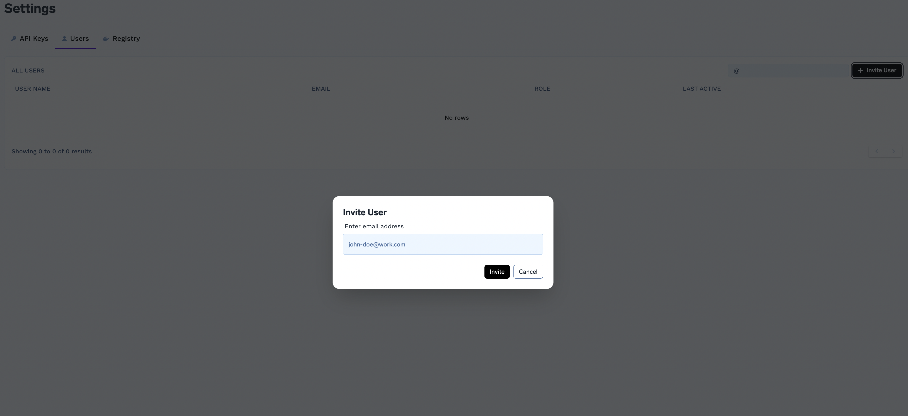
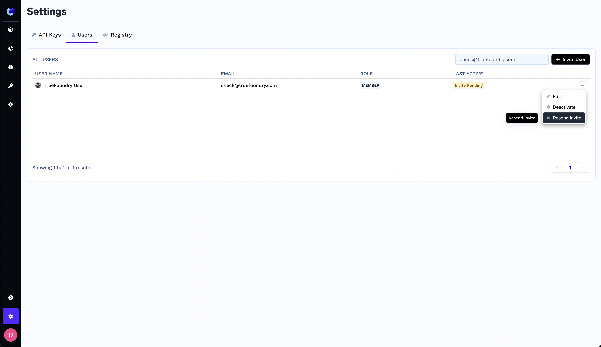
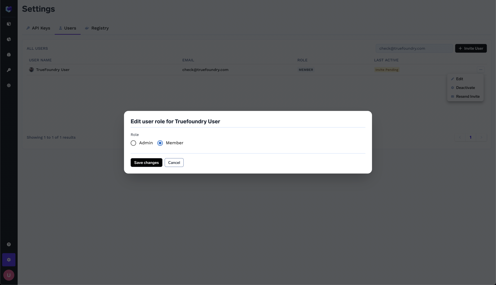

# Adding users to your truefoundry installation

Adding users to your truefoundry installation allows them to access the dashboard.
Users are added as against the `Member` role, which allows an easy view each of the truefoundry components you are using, including experiment tracking, model deployments and monitoring. Some functionality like the `Add clusters` and `Add docker registries` are limited to the `Admin` role.

- To add users, head to the Settings section, by click on the Gear icon from the bottom right.
- You should be able to see the `Users` section. Choose the section.

- On the right you will see an `Invite User` button. Click on the button.
- An `Invite User` modal will appear, where you can enter the email address of the user to be invited. 

- Upon entering the email id and clicking `Invite`, An email will be sent to user with the subject `You are invited to join Truefoundry`
- Once the email has been sent, you will see the user on the list with the status
`Invite Pending` in the Last Active column.

- If the user has not received the invite, you can click on `Resend Invite` from the menu against the user. 

- You can choose to promote a user to the `Admin` role, by chooing the `Edit` option from the menu against the user. Change the users role to `Admin` and Save the changes.

- If you wish to revoke access for any user, choose the option to `Deactivate` from the menu against the user and confirm your action.

