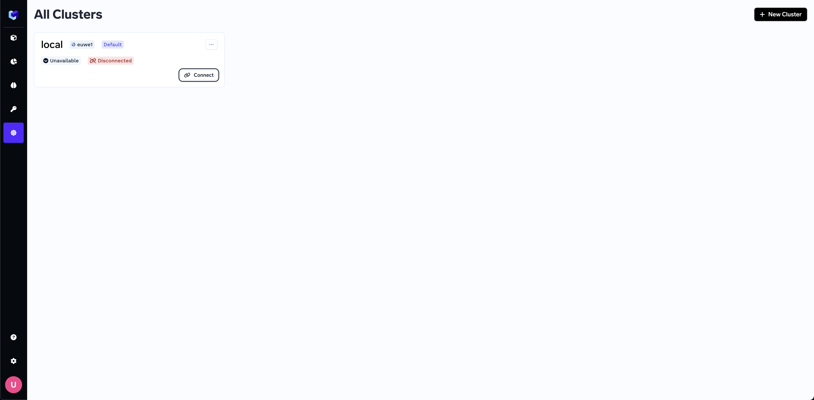
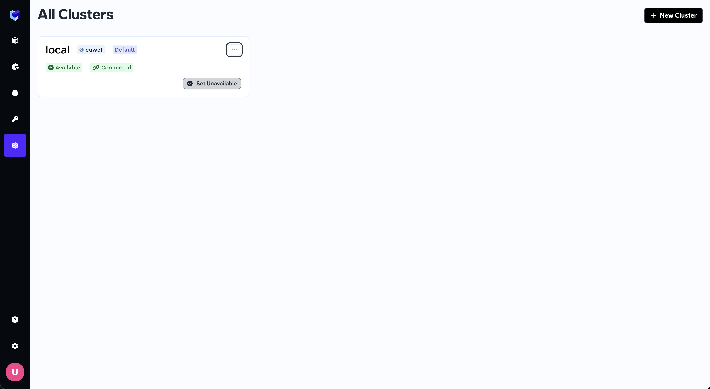
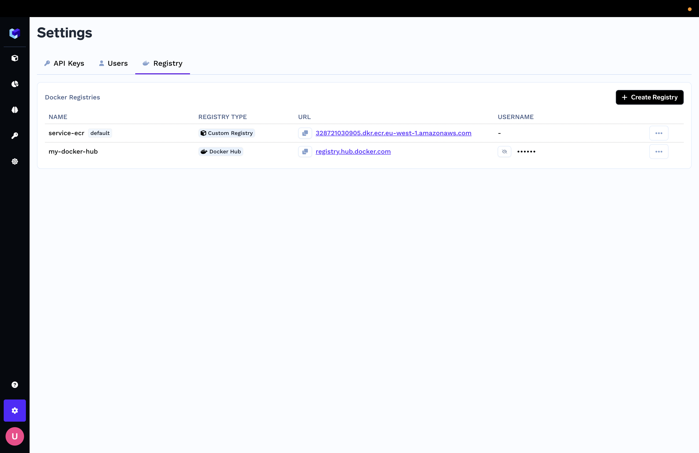

# Bootstrap Servicefoundry

Servicefoundry enables data scientists and MLEs to deploy workloads (any application / deployment / job) to 
any Kubernetes cluster. For this we need to tell ServiceFoundry which cluster to use. 

ServiceFoundry itself serves as the ControlPlane which can coordinate deployments across multiple clusters. The workload
clusters can be residing in any other region or in multiple cloud providers. 


We can always use the same physical cluster as the control plane and the tfy-workload cluster so that servicefoundry will deploy the 
workloads on the same cluster where it is deployed.

## Adding local cluster as workload cluster

We will now add the same physical cluster as the workload cluster also. This will be the most easiest flow to get started. If you want to add
another cluster as the workload cluster, please follow the next section. 

Once you login, please go to the clusters tab:



ServiceFoundry by default uses the current cluster - but we need to bootstrap it. To do that, please click on the `Connect` button.

This will then show the instruction to install the tfy-workload helm chart.

### Install tfy-workload helm chart

To do this, we need to do the following:

Create a values file (tfy-workload.yaml) as shown below. Fill up the values as provided by Truefoundry team
and what is relevant for your cluster. You can see the complete values file [here](https://github.com/truefoundry/charts/blob/main/charts/tfy-workload/values.yaml)

```
global:
  # The below are installation secrets that will be provided as is.
  # These are customised for your account. Please use the provided values as
  # is.
  imagePullCredentials: "<to_be_provided_by_truefoundry>"

  # Auth token for your workload cluster
  sfyAgentToken: "<to_be_taken_from_clusters_ui_in_truefoundry_dashboard>"

  # Host for the control plane. The default value is the inner cluster IP, but
  # you can provide the url of the dashboard in case control plane is on a different
  # cluster
  controlPlaneHost: "truefoundry-truefoundry-frontend-app.truefoundry.svc.cluster.local:3000"

  # Configure the below with the url that you configure in the ingress.
  # NOTE: This host should be accessible to control-plane
  workloadHost: "tfy-workload-sfy-proxy.tfy-workload.svc.cluster.local:3000"

  # Base domain url that will be used to map your services against this cluster.
  # Without this, all services deployed by Servicefoundry will be ClusterIP.
  baseDomainUrl: ""

  # Monitoring: we can provision grafana, loki, prometheous stacks within your cluster
  # 1. disabled : No monitoring components will be setup by truefoundry
  # 2. external: provide externalGrafanaUrl to redirect users from dashboard
  monitoring: disabled | external

  # This is mandatory incase of monitoring: external
  externalGrafanaUrl: ""

sfy-proxy:
  replicaCount: 2
  # You can choose to configure any one for dashboard ingress
  ingress:
    enabled: false
    annotations: {}
    labels: {}
    ingressClassName: istio
    tls: []
    hosts: []
    # hosts:
    #   - <workloadHost>
  istio:
    virtualservice:
      enabled: false
      annotations: {}
      gateways: []
      hosts: []
      # hosts:
      #   - <workloadHost>
```

Install the helm chart with this values file:

```
helm upgrade --install tfy-workload truefoundry/tfy-workload -f tfy-workload.yaml --wait
```

The above command can take a few seconds since it will wait for all the pods to come up. 

Once the pods are up and if everything is correct, you should see the status of the cluster as Connected on the UI. You might need to refresh the page to see the effect. Once its connected, you are all set to deploy workloads on the cluster.




### Adding another cluster as workload cluster

The workflow to add another cluster is quite similar to the flow above. In this case, you need to click on `New Cluster` and provide the following inputs. 

1. Name: This can be any string that helps you identify the cluster later (maybe something like example-org-aws-production)
2. Region: This specifies the region in which the cluster is present. It can be any string - but we recommend you to put the region as the region string of the cloud provider you are using. 

Once you have added the cluster, you will need to install the tfy-workload helm chart in the target cluster using the same instructions as done for local cluster. 

### Setup a Default Docker Image Registry

Storing Docker images of services that are built for model deployment and inference will require setup of a default Docker image registry. We support commonly used docker image registries like 
Dockerhub, Github, Gitlab out of the box. We also support any docker image registry that uses the standard username password flows. 

To setup the registry :

- Navigate to the settings section of your installed truefoundry dashboard, and go to the registry section. 


- Click on the `Create Registry` button, and add the credentials with a name, username, password and registry url. Registry urls for some common registries like dockerhub, github are pre configured. Any permissions required for these credentials are mentioned alongwith.


- Once added, the registry will show up in the list of registries. 



- On the registry you want to use as default, Choose the `Set default` option from the menu.


