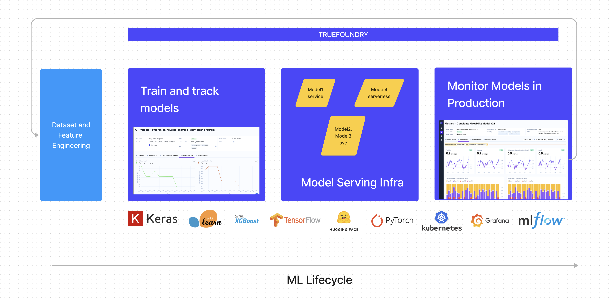

# Introduction

TrueFoundry is a platform that makes training, deploying and monitoring models very easy for both individuals and companies. 

TrueFoundry comes with experiment tracking, model deployment and monitoring - all at one place so that data scientists don't need to juggle between different tools and can have high levels of flexibility and independence to deploy their models with best practices and policies that can be configured by DevOps and engineering teams. 

Currently, there is lot of interdependence between the data science, data engineering and DevOps teams which leads to delays in implementation and development. We experienced the problem first-hand and have been working on inverting the flow to make production times for ML models much faster. 

## What is TrueFoundry?

TrueFoundry provides a single platform to log and track your experiments and models, deploy them in whatever configuration you want and then track their monitoring metrics. The key components are:

1. **Track your experiments and models**: TrueFoundry's tracking library called MLFoundry builds on top of the popular open source library MLFlow. We fixed a lot of the current issues in MLFlow - added authentication, a more intuitive UI, logging custom datatypes support while retaining the core APIs. This helps you integrate with all the integrations that come with MLFlow and also enables quick interoperability. 

2. **Deploy Your Models (COMING SOON)**: TrueFoundry's deployment library is called `servicefoundry` and makes it super easy to deploy models on managed Kubernetes clusters. Since we build on top of Kubernetes, it provides complete flexibilty to add any integrations that come with Kubernetes. 

3. **Monitor Your Models (COMING SOON)**: Since we already track models and the training data, TrueFoundry can also generate a lot of model monitoring metrics automatically like feature drift, prediction drift, etc. Datascientists can also add custom metrics - which provides them complete flexibility to monitor and alert on their models. 

4. **Demo your model (COMING SOON)**: Often times data scientists need to demo models to product managers or early users to get feedback. Building a frontend app requires learning frontend frameworks like React /Vue/Angular - however we make it very simple to demo models using Python. We use a mix of Streamlit and Gradio for this. 

5. **Run end to end pipelines (In the roadmap)**: We are also working on providing support for running end-to-end pipelines using KubeFlow, Metaflow and a few other frameworks.

## TrueFoundry Public Cloud
TrueFoundry is hosted as a public cloud for data scientists to try it out and host their models. The public cloud provides a multitenant system for experiment tracking, model deployment and monitoring. You get a free tier to run 1 model end to end with limited resources. However, you can purchase additional resources to run more heavy or multiple models. 

Our public cloud is still in alpha - so we don't recommend it for any production usecases yet. However, feel free to try out your hobby or test projects for faster iteration times and give us feedback. This will help us in making the platform much better.

## Try out TrueFoundry!
You can try TrueFoundry for your own personal usecase at https://app.truefoundry.com or also deploy TrueFoundry on your own cloud to provide the same developer experience to all ML teams. 

If you want to use TrueFoundry on your own cloud, please get in touch with us. As of now, we work well with the AWS ecosystem - but we do plan to extend support to other cloud providers.