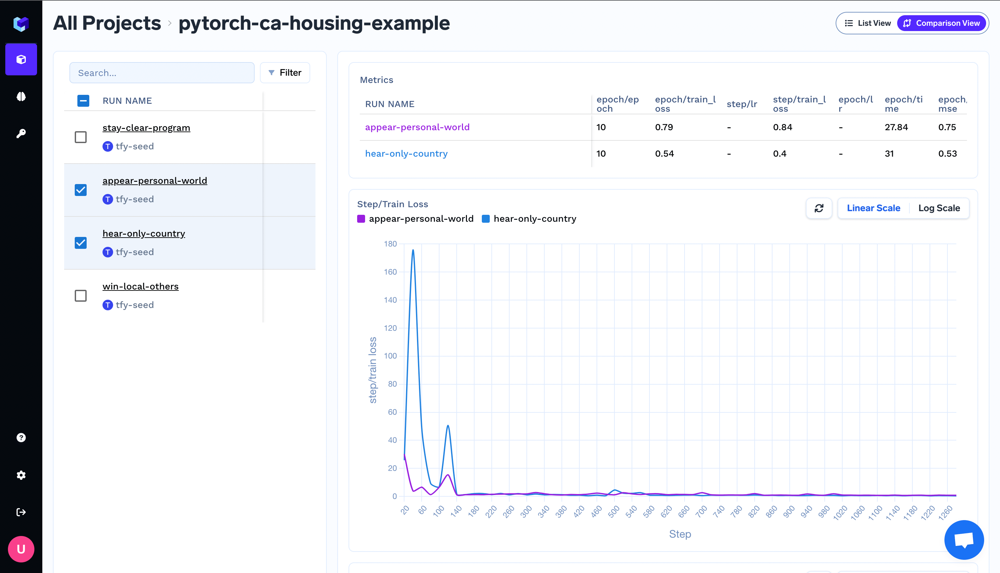

# Quick Start
Signup on our [website](https://app.truefoundry.com/settings) and get an API Key.


## 1. Track Your Experiments
Make your models reproducible by logging metrics, data and models.

### Install MLFoundry: 
Run the following command to install MLFoundry.

```
pip install mlfoundry
```

### Inject Log Lines in your training script

```python
import pandas as pd
import numpy as np
import sklearn
from sklearn import datasets, model_selection, svm, metrics
import mlfoundry as mlf

mlf_api = mlf.get_client(tracking_uri="SERVER_URI", api_key="REPLACE_YOUR_API_KEY")
mlf_run = mlf_api.create_run(project_name='iris-demo', run_name='svm-model')

# Load and Prep Data
iris = sklearn.datasets.load_iris()
X_train, X_test, y_train, y_test = sklearn.model_selection.train_test_split(iris.data,  iris.target, test_size=0.2)
mlf_run.log_dataset(features=pd.DataFrame(X_train), dataset_name="train")

# Model Training
clf = sklearn.svm.SVC(gamma='scale', kernel='rbf', probability=True)
clf.fit(X_train, y_train)
mlf_run.log_model(clf, "sklearn")

# Compute Metrics
y_hat_test, metrics_dict = clf.predict(X_test), {}
metrics_dict['accuracy_score'] = sklearn.metrics.accuracy_score(y_test, y_hat_test)
mlf_run.log_metrics(metrics_dict)
mlf_run.log_params(clf.get_params())
```

### View logged data in dashboard
Click [here](https://app.truefoundry.com/mlfoundry) to view your MlFoundry Dashboard


### Compare different runs
Click on the comparison view on top-right corner of MLFoundry dashboard to switch to comparison mode.



## 2. Deploy your Model (Coming Soon)
Deploy your model to production in 15 minutes.

<!-- ### Install Servicefoundry:
Run the following command to install ServiceFoundry.

```
pip install servicefoundry
```

### Write Service code
A predict function for the model needs to defined as shown below.

```python
import pandas as pd
import mlfoundry as mlf

mlf_api = mlf.get_client(tracking_uri="SERVER_URI", api_key="REPLACE_YOUR_API_KEY")
mlf_run = mlf_api.load_run(RUN_ID)

@app('iris/predict')
def predict(data)
    model = mlf_api.load_model('model_name')
    features = pd.DataFrame(data)
    prediction = model.predict(features)
    return prediction
```

### Deploy your service: 
Run the following command

```
servicefoundry deploy
``` -->

## 3. Monitor in production (Coming Soon)
Monitor your models (batch and realtime) for prediction drift, accuracy, feature and data drift.

<!-- ### Add log lines to your inference function

```python
import pandas as pd
import mlfoundry as mlf
mlf_api = mlf.get_client(api_key="REPLACE_YOUR_API_KEY")
mlf_run = mlf_api.load_run(RUN_ID)
@app('iris/predict')
def predict(data)
    model = mlf_api.load_model('model_name')
    features = pd.DataFrame(data)
    prediction = model.predict(features)
    # If you don’t pass the prediction_id the system will generate one for you to reference actuals later
    mlf_run.log_prediction(features, prediction, prediction_id=YOUR_UNIQUE_ID)
    return prediction
# This code can be logged from anywhere in your codebase
actual_val = some_val
mlf_run.log_actual(actual_val, prediction_id)
```

### View Model Monitoring Metrics


     -->
## 4. Showcase your model (Coming Soon)
Share a demo of your model with streamlit UI
<!-- ### One Line of Code to generate the UI

```python
import pandas as pd
import mlfoundry as mlf

mlf_api = mlf.get_client(tracking_uri="SERVER_URI", api_key="REPLACE_YOUR_API_KEY")
mlf_run = mlf_api.load_run(RUN_ID)

@app('iris/predict')
def predict(data)
    model = mlf_api.load_model('model_name')
    features = pd.DataFrame(data)
    prediction = model.predict(features)
    return prediction

# Add this line to generate the webapp
# Generic streamlit code- maybe to collect feedback for prediction, or building a model feedback tool.
mlf.webapp(predict, inputs=[number,number,number,number], outputs=[text])
```

### Deploy and share your model

 -->
